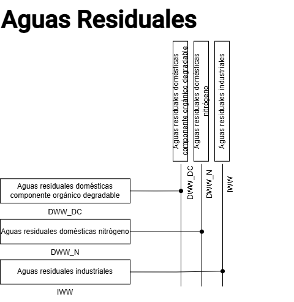

Estructura de los modelos
=========================

A continuación se presenta la estructura de los modelos de los diferentes sectores estudiados.

Estructura del modelo del sector Procesos Industriales y Uso de Productos (PIUP)
^^^^^^^^^^^^^^^^^^^^^^^^^^^^^^^^^^^^^^^^^^^^^^^^^^^^^^^^^^^^^^^^^^^^^^^^^^^^^^^^

El sector Procesos Industriales y Uso de Productos (PIUP), es uno de los sectores de mitigación estudiados por el Panel Intergubernamental de Expertos sobre el Cambio Climático (en inglés Intergovernmental Panel on Climate Change o conocido también por sus siglas IPCC). En Ecuador, el sector PIUP abarca varias categorías y subcategorías emisoras de GEI, de acuerdo con el INGEI de la 5ta Comunicación Nacional (5CN) del Ecuador (MAATE, n.d.), que se enlistan a continuación:

- **Categoría 2A: Industria de los minerales**
    - **Subcategoría 2A1:** Producción de Cemento
    - **Subcategoría 2A2:** Producción de Cal
    - **Subcategoría 2A3:** Producción de Vidrio
    - **Subcategoría 2A4a:** Cerámica
    - **Subcategoría 2A4b:** Otros Usos de la Soda Ash
- **Categoría 2C: Industria de los metales**
    - **Subcategoría 2C1:** Producción de Hierro y Acero
    - **Subcategoría 2C5:** Producción de Plomo
- **Categoría 2D: Uso de Productos no Energéticos de combustibles y de solventes**
    - **Subcategoría 2D1:** Uso de Lubricantes
    - **Subcategoría 2D2:** Uso de Cera Parafina
- **Categoría 2F: Uso de Productos como sustitutos para las substancias que agotan la capa de ozono**
    - **Subcategoría 2F1:** Refrigeración y Aire Acondicionado

Basado en lo anterior, se construye un modelo en la herramienta OSeMOSYS para poder representar la actividad y las emisiones anuales de las categorías y subcategorías del sector, así como para facilitar la construcción de varios escenarios basado en la adopción de diversas políticas, acciones o iniciativas. De forma simplificada, el modelo se ilustra en la Figura 1.

.. figure:: source/RSS_IPPU.png
   :alt: Diagrama del sector 
   :width: 100%
   :align: center

   Figura 1. Diagrama de referencia del modelo del sector PIUP.

En las Tablas 1, 2 y 3 se incluye la nomenclatura de los sets Technologies, Commodities y Emission del modelo de la Figura 1.

*Tabla 1: Tecnologías incluidas en el modelo OSeMOSYS del sector PIUP.*

.. table::
   :align: center

   +---------------------------------------------------------+---------------------+
   | Descripción                                             | Código              |
   +=========================================================+=====================+
   | Suministro de materia prima para clinker                | RAW_MAT_CLK         |
   +---------------------------------------------------------+---------------------+
   | Suministro de materia prima para cemento                | RAW_MAT_CEM         |
   +---------------------------------------------------------+---------------------+
   | Clinker importado o almacenado                          | IMP_STOR            |
   +---------------------------------------------------------+---------------------+
   | Importación de HFC                                      | IMP_REFR_AC         |
   +---------------------------------------------------------+---------------------+
   | Importación de HFC23                                    | IMP_HFC23           |
   +---------------------------------------------------------+---------------------+
   | Importación de HFC32                                    | IMP_HFC32           |
   +---------------------------------------------------------+---------------------+
   | Importación de HFC125                                   | IMP_HFC125          |
   +---------------------------------------------------------+---------------------+
   | Importación de HFC134a                                  | IMP_HFC134a         |
   +---------------------------------------------------------+---------------------+
   | Importación de HFC143a                                  | IMP_HFC143a         |
   +---------------------------------------------------------+---------------------+
   | Importación de HFC152a                                  | IMP_HFC152a         |
   +---------------------------------------------------------+---------------------+
   | Importación de HFC227ea                                 | IMP_HFC227ea        |
   +---------------------------------------------------------+---------------------+
   | Otros procesos industriales y uso de productos          | OTHER_IPPU          |
   +---------------------------------------------------------+---------------------+
   | Producción de clinker tradicional                       | PROD_CLK_TRAD       |
   +---------------------------------------------------------+---------------------+
   | Producción de cemento                                   | PROD_CEM            |
   +---------------------------------------------------------+---------------------+
   | Demanda - Producción de cemento                         | T5CEM_PRODIND       |
   +---------------------------------------------------------+---------------------+
   | Demanda - HFC                                           | T5REFR_ACIPPU       |
   +---------------------------------------------------------+---------------------+
   | Demanda - HFC23                                         | T5HFC23IPPU         |
   +---------------------------------------------------------+---------------------+
   | Demanda - HFC32                                         | T5HFC32IPPU         |
   +---------------------------------------------------------+---------------------+
   | Demanda - HFC125                                        | T5HFC125IPPU        |
   +---------------------------------------------------------+---------------------+
   | Demanda - HFC134a                                       | T5HFC134aIPPU       |
   +---------------------------------------------------------+---------------------+
   | Demanda - HFC143a                                       | T5HFC143aIPPU       |
   +---------------------------------------------------------+---------------------+
   | Demanda - HFC152a                                       | T5HFC152aIPPU       |
   +---------------------------------------------------------+---------------------+
   | Demanda - HFC227ea                                      | T5HFC227eaIPPU      |
   +---------------------------------------------------------+---------------------+
   | Demanda - Otros procesos industriales y uso de productos| T5OTHER_IPPUIPPU    |
   +---------------------------------------------------------+---------------------+
   | Producción de Cal                                       | LIME_PROD           |
   +---------------------------------------------------------+---------------------+
   | Producción de Vidrio                                    | GLASS_PROD          |
   +---------------------------------------------------------+---------------------+
   | Cerámica                                                | CERAMICS            |
   +---------------------------------------------------------+---------------------+
   | Otros usos de Soda Ash                                  | SODA_ASH            |
   +---------------------------------------------------------+---------------------+
   | Producción de Hierro y Acero                            | IRON_STEEL          |
   +---------------------------------------------------------+---------------------+
   | Producción de Plomo                                     | LEAD_PROD           |
   +---------------------------------------------------------+---------------------+
   | Uso de Lubricantes                                      | LUBRI               |
   +---------------------------------------------------------+---------------------+
   | Uso de Ceras de parafina                                | PARAFFIN            |
   +---------------------------------------------------------+---------------------+
   | Demanda - Producción de Cal                             | T5LIME_PRODIPPU     |
   +---------------------------------------------------------+---------------------+
   | Demanda - Producción de Vidrio                          | T5GLASS_PRODIPPU    |
   +---------------------------------------------------------+---------------------+
   | Demanda - Cerámica                                      | T5CERAMICSIPPU      |
   +---------------------------------------------------------+---------------------+
   | Demanda - Otros usos de Soda Ash                        | T5SODA_ASHIPPU      |
   +---------------------------------------------------------+---------------------+
   | Demanda - Producción de Hierro y Acero                  | T5IRON_STEELIPPU    |
   +---------------------------------------------------------+---------------------+
   | Demanda - Producción de Plomo                           | T5LEAD_PRODIPPU     |
   +---------------------------------------------------------+---------------------+
   | Demanda - Uso de Lubricantes                            | T5LUBRIIPPU         |
   +---------------------------------------------------------+---------------------+
   | Demanda - Uso de Ceras de parafina                      | T5PARAFFINIPPU      |
   +---------------------------------------------------------+---------------------+

*Tabla 2: Commodities incluidos en el modelo OSeMOSYS del sector PIUP.*

.. table:: 
   :align: center

   +----------------------------------------------------------+---------------------+
   | Descripción                                              | Código              |
   +==========================================================+=====================+
   | Materia prima para Clinker                               | RAW_MAT_CLK         |
   +----------------------------------------------------------+---------------------+
   | Materia prima para cemento                               | RAW_MAT_CEM         |
   +----------------------------------------------------------+---------------------+
   | Producción de Clinker                                    | CLK_PROD            |
   +----------------------------------------------------------+---------------------+
   | Refrigeración y Aire Acondicionado                       | REFR_AC             |
   +----------------------------------------------------------+---------------------+
   | HFC23                                                    | HFC23               |
   +----------------------------------------------------------+---------------------+
   | HFC32                                                    | HFC32               |
   +----------------------------------------------------------+---------------------+
   | HFC125                                                   | HFC125              |
   +----------------------------------------------------------+---------------------+
   | HFC134a                                                  | HFC134a             |
   +----------------------------------------------------------+---------------------+
   | HFC143a                                                  | HFC143a             |
   +----------------------------------------------------------+---------------------+
   | HFC152a                                                  | HFC152a             |
   +----------------------------------------------------------+---------------------+
   | HFC227ea                                                 | HFC227ea            |
   +----------------------------------------------------------+---------------------+
   | Otros procesos industriales y uso de productos           | OTHER_IPPU          |
   +----------------------------------------------------------+---------------------+
   | Producción de cemento                                    | CEM_PROD            |
   +----------------------------------------------------------+---------------------+
   | Demanda - Producción de cemento                          | E5INDCEM_PROD       |
   +----------------------------------------------------------+---------------------+
   | Demanda - Refrigeración y Aire Acondicionado             | E5IPPUREFR_AC       |
   +----------------------------------------------------------+---------------------+
   | Demanda - HFC23                                          | E5IPPUHFC23         |
   +----------------------------------------------------------+---------------------+
   | Demanda - HFC32                                          | E5IPPUHFC32         |
   +----------------------------------------------------------+---------------------+
   | Demanda - HFC125                                         | E5IPPUHFC125        |
   +----------------------------------------------------------+---------------------+
   | Demanda - HFC134a                                        | E5IPPUHFC134a       |
   +----------------------------------------------------------+---------------------+
   | Demanda - HFC143a                                        | E5IPPUHFC143a       |
   +----------------------------------------------------------+---------------------+
   | Demanda - HFC152a                                        | E5IPPUHFC152a       |
   +----------------------------------------------------------+---------------------+
   | Demanda - HFC227ea                                       | E5IPPUHFC227ea      |
   +----------------------------------------------------------+---------------------+
   | Demanda - Otros procesos industriales y uso de productos | E5IPPUOTHER_IPPU    |
   +----------------------------------------------------------+---------------------+
   | Producción de Cal                                        | LIME_PROD           |
   +----------------------------------------------------------+---------------------+
   | Producción de Vidrio                                     | GLASS_PROD          |
   +----------------------------------------------------------+---------------------+
   | Cerámica                                                 | CERAMICS            |
   +----------------------------------------------------------+---------------------+
   | Otros usos de Soda Ash                                   | SODA_ASH            |
   +----------------------------------------------------------+---------------------+
   | Producción de Hierro y Acero                             | IRON_STEEL          |
   +----------------------------------------------------------+---------------------+
   | Producción de Plomo                                      | LEAD_PROD           |
   +----------------------------------------------------------+---------------------+
   | Uso de Lubricantes                                       | LUBRI               |
   +----------------------------------------------------------+---------------------+
   | Uso de Ceras de parafina                                 | PARAFFIN            |
   +----------------------------------------------------------+---------------------+
   | Demanda - Producción de Cal                              | E5IPPULIME_PROD     |
   +----------------------------------------------------------+---------------------+
   | Demanda - Producción de Vidrio                           | E5IPPUGLASS_PROD    |
   +----------------------------------------------------------+---------------------+
   | Demanda - Cerámica                                       | E5IPPUCERAMICS      |
   +----------------------------------------------------------+---------------------+
   | Demanda - Otros usos de Soda Ash                         | E5IPPUSODA_ASH      |
   +----------------------------------------------------------+---------------------+
   | Demanda - Producción de Hierro y Acero                   | E5IPPUIRON_STEEL    |
   +----------------------------------------------------------+---------------------+
   | Demanda - Producción de Plomo                            | E5IPPULEAD_PROD     |
   +----------------------------------------------------------+---------------------+
   | Demanda - Uso de Lubricantes                             | E5IPPULUBRI         |
   +----------------------------------------------------------+---------------------+
   | Demanda - Uso de Ceras de parafina                       | E5IPPUPARAFFIN      |
   +----------------------------------------------------------+---------------------+

*Tabla 3: Emisiones incluidas en el modelo OSeMOSYS del sector PIUP.*

.. table::
   :align: center

   +--------------------------------------------------------------------------+-------------+
   | Descripción                                                              | Código      |
   +==========================================================================+=============+
   | Dióxido de carbono equivalente producido por Hidrofluorocarbonos         | CO2e_HFC    |
   +--------------------------------------------------------------------------+-------------+
   | Dióxido de carbono equivalente producido por el proceso de producción de | CO2e_CEM    |
   | cemento                                                                  |             |
   +--------------------------------------------------------------------------+-------------+
   | Dióxido de carbono equivalente producido por otros Procesos Industriales | CO2e_IPPU   |
   | y Uso de Productos                                                       |             |
   +--------------------------------------------------------------------------+-------------+

Estructura del modelo del sector Residuos
^^^^^^^^^^^^^^^^^^^^^^^^^^^^^^^^^^^^^^^^^

Otro de los sectores de mitigación estudiados por el IPCC es el sector Residuos. Este sector produce emisiones por varias prácticas de disposición y tratamiento de residuos sólidos y aguas residuales generadas en el país. En cuanto a GEI, en el sector se genera principalmente metano (CH4) y óxido nitroso (N2O) por la descomposición de materia orgánica, además de CO2 por la incineración de residuos sólidos, aportando a la liberación bruta de emisiones de CO2e en el Ecuador. Las categorías y subcategorías que conforman este sector se enlistan a continuación:

- **5A: Disposición de residuos sólidos**
    - **5A1:** Sitios de disposición de residuos sólidos gestionados
    - **5A2:** Sitios de disposición de residuos sólidos no gestionados
- **5B: Tratamiento biológico de residuos sólidos**
    - **5B1:** Compostaje
- **5C: Incineración y quema abierta de residuos**
    - **5C1:** Incineración de residuos
- **5D: Eliminación y tratamiento de aguas residuales**
    - **5D1:** Aguas residuales domésticas
    - **5D2:** Aguas residuales industriales

Basado en lo anterior, se construye un modelo en la herramienta OSeMOSYS para poder representar la actividad y las emisiones anuales de las categorías y subcategorías del sector, así como para facilitar la construcción de varios escenarios basado en iniciativas de disposición adecuada, reducción y tratamiento de residuos sólidos y aguas residuales. De forma simplificada, el modelo que simula el comportamiento del sector residuos sólidos se ilustra en la Figura 2. Por su parte el modelo que representa las aguas residuales se muestra en la Figura 3.

.. figure:: source/RSS_Waste_Sol.png
   :alt: Diagrama del sector 
   :width: 100%
   :align: center

   Figura 2. Diagrama de referencia del modelo del sector Residuos Sólidos.

   Figura 3. Diagrama de referencia del modelo del sector Aguas Residuales.

En las Tablas 4, 5 y 6 se incluye la nomenclatura de los sets Technologies, Commodities y Emission del modelo de las Figura 2 y 3.

*Tabla 4: Tecnologías incluidas en el modelo OSeMOSYS del sector PIUP.*

.. table::
   :align: center

   +------------------------------------------------------------------------+------------------------+
   | Descripción                                                            | Código                 |
   +========================================================================+========================+
   | Reciclaje de residuos inorgánicos separados en sitio de disposición    | INORG_RCY_OS           |
   | final                                                                  |                        |
   +------------------------------------------------------------------------+------------------------+
   | Digestión anaerobia                                                    | AD                     |
   +------------------------------------------------------------------------+------------------------+
   | Compostaje                                                             | COMPOST                |
   +------------------------------------------------------------------------+------------------------+
   | Relleno sanitario                                                      | LANDFILL               |
   +------------------------------------------------------------------------+------------------------+
   | Botadero a cielo abierto                                               | NO_CONTR_OD            |
   +------------------------------------------------------------------------+------------------------+
   | Coprocesamiento                                                        | COPROC                 |
   +------------------------------------------------------------------------+------------------------+
   | Incineración controlada                                                | INCIN                  |
   +------------------------------------------------------------------------+------------------------+
   | Quema a cielo abierto                                                  | OPEN_BURN              |
   +------------------------------------------------------------------------+------------------------+
   | Disposición en sitios clandestinos                                     | SIT_CLAN               |
   +------------------------------------------------------------------------+------------------------+
   | Aprovechamiento del metano de rellenosanitario para generación de      | LANDFILL_ELEC          |
   | electricidad                                                           |                        |
   +------------------------------------------------------------------------+------------------------+
   | Aguas residuales domésticas componente (orgánico degradable)           | DWW_DC                 |
   +------------------------------------------------------------------------+------------------------+
   | Aguas residuales domésticas (nitrógeno)                                | DWW_N                  |
   +------------------------------------------------------------------------+------------------------+
   | Aguas residuales industriales                                          |  IWW                   |
   +------------------------------------------------------------------------+------------------------+
   | Separación de residuos inorgánicos en sitio de disposición final       | OSS_INORG              |
   +------------------------------------------------------------------------+------------------------+
   | Separación de residuos orgánicos en sitio de disposición final         | OSS_ORG                |
   +------------------------------------------------------------------------+------------------------+
   | No separación de residuos mezclados en sitio de disposición final      | NO_OSS_BLEND           |
   +------------------------------------------------------------------------+------------------------+
   | No recolección de residuos sólidos en sitio de disposición final       | NO_OSS_NO_COLL         |
   +------------------------------------------------------------------------+------------------------+
   | Recolección diferenciada de residuos inorgánicos                       | INORG_DCOLL            |
   +------------------------------------------------------------------------+------------------------+
   | Recolección diferenciada de residuos orgánicos                         | ORG_DCOLL              |
   +------------------------------------------------------------------------+------------------------+
   | Recolección no diferenciada de residuos mezclados                      | BLEND_NO_DCOLL         |
   +------------------------------------------------------------------------+------------------------+
   | No recolección de residuos sólidos                                     | BLEND_NO_COLL          |
   +------------------------------------------------------------------------+------------------------+
   | Separación de residuos inorgánicos en la fuente                        | INORG_SS               |
   +------------------------------------------------------------------------+------------------------+
   | Separación de residuos orgánicos en la fuente                          | ORG_SS                 |
   +------------------------------------------------------------------------+------------------------+
   | No separación de residuos en la fuente                                 | NO_SS                  |
   +------------------------------------------------------------------------+------------------------+
   | Generación total de residuos sólidos                                   | T5TSWTSW               |
   +------------------------------------------------------------------------+------------------------+
   | Recuperación de metano a partir de residuos sólidos en relleno         | T5LANDFILL_ELECTSW     |
   | sanitario para generación de electricidad                              |                        |
   +------------------------------------------------------------------------+------------------------+
   | Demanda - Aguas residuales domésticas componente (orgánico degradable) | T5DWW_DCWW             |
   +------------------------------------------------------------------------+------------------------+
   | Demanda - Aguas residuales domésticas (nitrógeno)                      | T5DWW_NWW              |
   +------------------------------------------------------------------------+------------------------+
   | Demanda - Aguas residuales industriales                                | T5IWWWW                |
   +------------------------------------------------------------------------+------------------------+
   | PTAR Emission reductions                                               | PTAR_ER                |
   +------------------------------------------------------------------------+------------------------+

*Tabla 5: Commodities incluidos en el modelo OSeMOSYS del sector PIUP.*

.. table::
   :align: center

   +------------------------------------------------------------------------+------------------------+
   | Descripción                                                            | Código                 |
   +========================================================================+========================+
   | Residuos inorgánicos separados en el sitio de disposición final        | OSS_INORG              |
   +------------------------------------------------------------------------+------------------------+
   | Residuos orgánicos separados en el sitio de disposición final          | OSS_ORG                |
   +------------------------------------------------------------------------+------------------------+
   | Residuos no separados en el sitio de disposición final                 | NO_OSS                 |
   +------------------------------------------------------------------------+------------------------+
   | Residuos en sitios de disposición final clandestinos no recolectados   | NO_COLL_SDF            |
   +------------------------------------------------------------------------+------------------------+
   | Aprovechamiento del metano de relleno sanitario para generación de     | LANDFILL_ELEC          |
   | electricidad                                                           |                        |
   +------------------------------------------------------------------------+------------------------+
   | Aguas residuales domésticas componente (orgánico degradable)           | DWW_DC                 |
   +------------------------------------------------------------------------+------------------------+
   | Aguas residuales domésticas (nitrógeno)                                | DWW_N                  |
   +------------------------------------------------------------------------+------------------------+
   | Aguas residuales industriales                                          | IWW                    |
   +------------------------------------------------------------------------+------------------------+
   | Residuos inorgánicos recolectados                                      | COLL_INORG             |
   +------------------------------------------------------------------------+------------------------+
   | Residuos orgánicos recolectados                                        | COLL_ORG               |
   +------------------------------------------------------------------------+------------------------+
   | Residuos mezclados recolectados                                        | COLL_BLEND             |
   +------------------------------------------------------------------------+------------------------+
   | Residuos mezclados no recolectados                                     | NO_COLL                |
   +------------------------------------------------------------------------+------------------------+
   | Residuos inorgánicos separados en la fuente                            | INORGSS                |
   +------------------------------------------------------------------------+------------------------+
   | Residuos orgánicos separados en la fuente                              | ORGSS                  |
   +------------------------------------------------------------------------+------------------------+
   | Residuos no separados en la fuente                                     | NOSS                   |
   +------------------------------------------------------------------------+------------------------+
   | Residuos sólidos totales                                               | TSW                    |
   +------------------------------------------------------------------------+------------------------+
   | Demanda - Residuos sólidos totales                                     | E5TSWTSW               |
   +------------------------------------------------------------------------+------------------------+
   | Demanda - Aprovechamiento del metano de rellenosanitario para          | E5TSWLANDFILL_ELEC     |
   | generación de electricidad                                             |                        |
   +------------------------------------------------------------------------+------------------------+
   | Demanda - Aguas residuales domésticas componente (orgánico degradable) | E5WWDWW_DC             |
   +------------------------------------------------------------------------+------------------------+
   | Demanda - Aguas residuales domésticas (nitrógeno)                      | E5WWDWW_N              |
   +------------------------------------------------------------------------+------------------------+
   | Demanda - Aguas residuales industriales                                | E5WWIWW                |
   +------------------------------------------------------------------------+------------------------+

*Tabla 6: Emisiones incluidas en el modelo OSeMOSYS del sector PIUP.*

.. table:: 
   :align: center

   +-----------------------------------------------------------+-------------+
   | Descripción                                               | Código      |
   +===========================================================+=============+
   | Óxido nitroso producido por el sector residuos            | N2O_WASTE   |
   +-----------------------------------------------------------+-------------+
   | Metano producido por el sector residuos                   | CH4_WASTE   |
   +-----------------------------------------------------------+-------------+
   | Dióxido de carbono producido por el sector residuos       | CO2_WASTE   |
   +-----------------------------------------------------------+-------------+
   | Dióxido de carbono equivalente producido por el sector    | CO2e_WASTE  |
   | residuos                                                  |             |
   +-----------------------------------------------------------+-------------+

