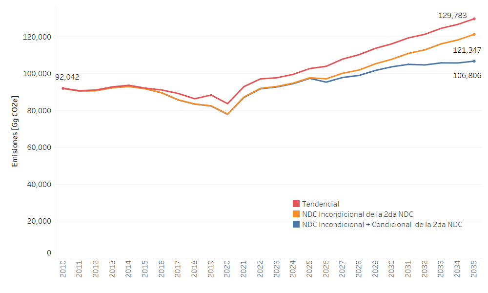

====================================
Emisiones Nacionales NDC
====================================

Las Emisiones Nacionales del Ecuador según las medidas analizadas en la NDC se observan en la Figura 1.

El análisis según tipo de gas para el escenario Incondicional se muestra en la Tabla 1. 

.. csv-table:: Emisiones Escenario Incondicional en Gg de CO2e
   :header: "Categoría", "2023", "2024", "2025", "2026", "2027", "2028", "2029", "2030", "2031", "2032", "2033", "2034", "2035"
   :widths: 30, 10, 10, 10, 10, 10, 10, 10, 10, 10, 10, 10, 10, 10

   "Emisiones de CO2 incluyendo emisiones netas de USCUSS", "66,313", "66,819", "68,564", "66,920", "68,234", "67,615", "69,370", "70,118", "72,366", "73,283", "75,387", "76,301", "78,100"
   "Emisiones de CO2 excluyendo emisiones netas de USCUSS", "43,342", "44,082", "46,058", "44,807", "46,349", "45,956", "47,775", "48,746", "51,215", "52,351", "54,673", "55,802", "57,816"
   "Emisiones de CH4", "20,007", "20,660", "21,229", "21,580", "22,571", "24,267", "25,215", "26,269", "26,991", "27,786", "28,682", "29,635", "30,638"
   "Emisiones de N2O", "4,130", "4,343", "4,445", "4,637", "4,830", "4,981", "5,144", "5,296", "5,410", "5,556", "5,726", "5,871", "6,028"
   "HFCs", "2,384", "2,810", "3,237", "3,663", "4,090", "4,516", "4,942", "5,369", "5,380", "5,391", "5,403", "5,414", "5,425"
   "Total con USCUSS", "92,834", "94,632", "97,475", "96,800", "99,725", "101,379", "104,671", "107,052", "110,147", "112,016", "115,198", "117,221", "120,191"
   "Total sin USCUSS", "69,863", "71,895", "74,969", "74,687", "77,840", "79,720", "83,076", "85,680", "88,996", "91,084", "94,484", "96,722", "99,907"

El análisis según tipo de gas para el escenario Condicional + Incondicional se muestra en la Tabla 2. 

.. csv-table:: Emisiones Escenario Incondiconal + Condicional en Gg de CO2e
   :header: "Categoría", "2023", "2024", "2025", "2026", "2027", "2028", "2029", "2030", "2031", "2032", "2033", "2034", "2035"
   :widths: 30, 10, 10, 10, 10, 10, 10, 10, 10, 10, 10, 10, 10, 10

   "Emisiones de CO2 incluyendo emisiones netas de USCUSS", "68,059", "68,351", "69,772", "66,535", "67,365", "66,314", "67,657", "67,925", "68,684", "67,751", "68,114", "67,234", "67,345"
   "Emisiones de CO2 excluyendo emisiones netas de USCUSS", "45,088", "45,614", "47,267", "45,939", "47,290", "46,760", "48,462", "49,246", "50,520", "50,102", "50,976", "50,607", "51,226"
   "Emisiones de CH4", "20,007", "20,660", "21,229", "21,574", "22,558", "24,040", "24,881", "25,847", "26,478", "27,182", "28,025", "28,932", "29,893"
   "Emisiones de N2O", "2,384.00", "2,810.30", "3,236.70", "3,583.80", "3,931.00", "4,278.10", "4,625.20", "4,998.50", "4,956.70", "4,914.90", "4,873.10", "4,831.30", "4,789.50"
   "HFCs", "2,384", "2,810", "3,237", "3,584", "3,931", "4,278", "4,625", "4,999", "4,957", "4,915", "4,873", "4,831", "4,790"
   "Total con USCUSS", "92,834", "94,632", "97,475", "95,276", "97,785", "98,910", "101,789", "103,769", "105,075", "104,763", "105,885", "105,829", "106,817"
   "Total sin USCUSS", "69,863", "71,895", "74,969", "74,680", "77,711", "79,356", "82,593", "85,090", "86,912", "87,113", "88,747", "89,201", "90,698"

